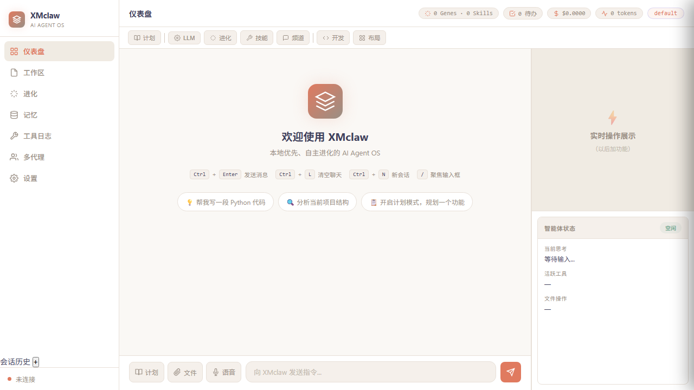

# 🦞 XMclaw — Local-First, Self-Evolving AI Agent Runtime

<p align="center">
  <strong>Your AI agent that runs on your machine. Thinks. Acts. Remembers. Improves itself.</strong>
</p>

<p align="center">
  <a href="https://github.com/1593959/XMclaw/actions/workflows/python-ci.yml"></a>
  <a href="https://github.com/1593959/XMclaw/releases"></a>
  <a href="LICENSE"></a>
  <a href="https://python.org"></a>
  <a href="https://github.com/1593959/XMclaw/actions/workflows/python-ci.yml"></a>
</p>

> ### 🚀 v2 delivery status (2026-04-21)
>
> A ground-up v2 rewrite is live on `main`. The self-evolution spine —
> streaming observer bus + honest grader + online scheduler + versioned
> skill registry + autonomous evolution controller — is **validated on a
> real LLM with no human in the loop**:
>
> | Live bench | On | Result | Gate |
> |---|---|---|---|
> | [Learning curve](tests/bench/phase1_live_learning_curve.py) | MiniMax | **1.12× over uniform baseline** | ≥ 1.05× |
> | [Tool-aware loop](tests/bench/phase2_tool_aware_live.py) | MiniMax | **100% real tool-firing** on every scored turn | ≥ 80% |
> | [Autonomous evolution](tests/bench/phase3_autonomous_evolution_live.py) | MiniMax | **1.18× session-over-session** after auto-promote | ≥ 1.05× |
>
> **410 v2 tests pass across Windows / macOS / Linux.** End-to-end
> usable via the v2 CLI:
>
> ```bash
> xmclaw v2 ping                 # bus round-trip smoke test
> xmclaw v2 serve                # FastAPI + WS daemon
>                                #   reads daemon/config.json (LLM key + fs allowlist)
>                                #   writes pairing token to ~/.xmclaw/v2/ (0600)
> xmclaw v2 chat                 # interactive REPL talking to the daemon
> ```
>
> **12 / 14 anti-requirements** are encoded in code with dedicated tests,
> including ClawJacked-style cross-origin WS hijack defense (pairing
> token, constant-time compare, `close(4401)` on invalid auth). See the
> full scorecard in [docs/V2_STATUS.md](docs/V2_STATUS.md). Design docs:
> [docs/REWRITE_PLAN.md](docs/REWRITE_PLAN.md) ·
> [docs/V2_DEVELOPMENT.md](docs/V2_DEVELOPMENT.md).
>
> v1 modules still live alongside v2 during strangler-fig transition — the
> shipping installer continues to use v1 until Phase 4 (daemon integration +
> release pipeline rewrite) completes.

**XMclaw** is a personal AI agent that runs entirely on your machine. It is not a chatbot — it is a runtime that can think, act, remember, and continuously improve itself over time.

Unlike a stateless chat interface, XMclaw keeps a durable memory across sessions, executes real tools on your filesystem, and runs an evidence-based evolution loop (Honest Grader → Online Scheduler → Skill Registry) that promotes new skill versions when the measured outcomes beat the incumbent — not when the model claims they do.

[Docs](./docs) · [Architecture](./docs/ARCHITECTURE.md) · [Tools](./docs/TOOLS.md) · [Events](./docs/EVENTS.md) · [Doctor](./docs/DOCTOR.md) · [Config](./docs/CONFIG.md) · [Roadmap](./docs/DEV_ROADMAP.md)

---

## ✨ What makes XMclaw different

| | |
|---|---|
| **🧠 Evolution-as-Runtime** | Every LLM call, tool invocation, and skill execution becomes a `BehavioralEvent`. An **Honest Grader** scores outcomes on hard evidence (did the tool actually run? was a real side effect produced?), the **Online Scheduler** treats skills as bandit arms, and the **EvolutionController** promotes or rolls back versions — no LLM self-assessment in the decision loop. |
| **💾 Local-First State** | Events, memory, and pairing token all live in `~/.xmclaw/v2/` (SQLite + sqlite-vec). `XMC_DATA_DIR` moves the whole workspace in one lever. Nothing leaves your disk unless you explicitly opt in. |
| **🔁 Event Replay** | Every WS reconnect replays the session's events so the UI hydrates without round-tripping the LLM. `/api/v2/events` supports `session_id` / `since` / `types` filters + FTS5 keyword search. |
| **🛡️ Anti-Req Driven** | 14 explicit anti-requirements (e.g. "Scheduler must not trust text that describes a tool call", "no LLM self-grading", "WS auth via pairing token with `close(4401)`"). Each is encoded in the code path with a dedicated test; violations emit `ANTI_REQ_VIOLATION` events. |
| **🔌 MCP + Provider Model** | Tools are composed from `ToolProvider` backends: `builtin`, `browser` (Playwright), `lsp`, `mcp_bridge` (stdio / SSE / WS). Add your own by implementing `list_tools()` + `invoke()`. |
| **🩺 Doctor with Plugins** | `xmclaw doctor` runs 11 built-in checks + any third-party check registered on the `xmclaw.doctor` entry-point group. `--fix` auto-remediates 4 of them. |
| **🛰️ Structured Events** | Typed `BehavioralEvent` stream over WebSocket at `/agent/v2/{session_id}`. No custom XML parsing — tool calls are decoded by per-provider translators into a structured `ToolCall` IR. |
| **🧪 Smart-Gate CI** | `scripts/test_changed.py` maps edited paths to test lanes via `scripts/test_lanes.yaml` — PRs only run the tests they can actually break; main runs the full suite. |

---

## Install

```bash
# Clone
git clone https://github.com/1593959/XMclaw.git
cd XMclaw

# Install
pip install -e .

# With dev extras (pytest, ruff, mypy)
pip install -e ".[dev]"

# Optional: computer-use support
pip install pyautogui mss
pip install playwright && playwright install chromium
```

First run creates `daemon/config.json` automatically. Configure your API keys:

```bash
xmclaw config init
# or edit daemon/config.json directly
# or set env: XMC__llm__anthropic__api_key="sk-ant-..."
```

Verify your setup:

```bash
xmclaw doctor
```

---

## Quick Start

```bash
# Start daemon + web UI
xmclaw start
# → open http://127.0.0.1:8765

# Rich CLI
xmclaw chat
xmclaw chat --plan    # plan mode: see the execution plan before it runs

# Stop daemon
xmclaw stop
```

---

## 📸 UI Preview



*Warm cream-toned Dashboard with coral accents — designed for extended use*

## 🗂️ Architecture

```
Clients (Web UI / CLI / channel adapters)
         ↕  WS /agent/v2/{session_id}   +   HTTP /api/v2/*
┌──────────────────────────────────────┐
│  Daemon  (FastAPI + Uvicorn)         │
│  ├── AgentLoop  (per session)        │
│  │    run_turn: user → LLM → tools → │
│  │               tools → LLM → done  │
│  │                                   │
│  ├── LLMProvider   (anthropic / openai + translators)
│  ├── ToolProvider  (builtin / browser / lsp / mcp / composite)
│  ├── MemoryProvider (sqlite-vec)     │
│  ├── Skills   (SkillBase + Registry) │
│  ├── SkillScheduler  (bandit / promote / rollback)
│  ├── HonestGrader    (ran / returned / type_matched / side_effect)
│  ├── EvolutionController (candidate → grader → promote)
│  │                                   │
│  └── EventBus  (InProcess + SQLite WAL + FTS5)
│        ↑ subscribers: grader, scheduler, memory, cost, WS forward
└──────────────────────────────────────┘
         Data:  ~/.xmclaw/v2/{events.db, memory.db, pairing_token.txt, daemon.pid}
```

Authoritative design: [docs/ARCHITECTURE.md](docs/ARCHITECTURE.md) · Event contract: [docs/EVENTS.md](docs/EVENTS.md) · Tool contract: [docs/TOOLS.md](docs/TOOLS.md) · Data layout: [docs/WORKSPACE.md](docs/WORKSPACE.md).

---

## 🔄 How evolution works in v2

Evolution is the runtime path, not a batch job:

1. **Propose** — the `EvolutionController` emits `skill_candidate_proposed` (could be a human-written skill or an LLM-proposed variant).
2. **Exercise** — the `SkillScheduler` routes real turns to candidate versions as bandit arms; real `ToolCall` / `ToolResult` events are generated.
3. **Grade on evidence** — the `HonestGrader` reads the event stream and decides `ran / returned / type_matched / side_effect_observable` per call. An LLM's opinion can contribute ≤ 0.2 weight; the hard signals dominate.
4. **Promote or roll back** — the scheduler reads graded verdicts, emits `skill_promoted` or `skill_rolled_back` with `evidence: list[str]`. Promotion is a registry mutation; the next turn uses the new HEAD without restart.
5. **Audit forever** — every step is a `BehavioralEvent` in `events.db` (SQLite WAL + FTS5) — any decision can be replayed end-to-end months later.

On MiniMax, the full autonomous cycle lifts session-level mean reward by **18%** session-over-session with no human in the loop (`tests/bench/phase3_autonomous_evolution_live.py`).

---

## 🛡️ Security

XMclaw treats anything it didn't generate as untrusted:

- **WS pairing token** — the daemon writes a 0600 token to `~/.xmclaw/v2/pairing_token.txt` on start; WS connects without it get `close(4401)`. Constant-time compare (`xmclaw/daemon/auth.py`).
- **Filesystem sandbox** — `tools.allowed_dirs` in `daemon/config.json` gates every `file_read` / `file_write` / `list_dir` argument; traversal attempts return `ToolResult(ok=False)`.
- **No shell metacharacter parsing** — `bash` tool uses `subprocess.run(argv, shell=False)`. Nothing the model emits can be interpreted by a shell.
- **Prompt-injection scanner** — every `ToolResult.content` passes `xmclaw.security.prompt_scanner.scan_text` before returning to the LLM; detections emit `PROMPT_INJECTION_DETECTED` (anti-req #14).
- **Skill isolation** — `providers/runtime/process.py` runs untrusted skills in subprocesses with wall-clock + CPU caps; no module-level state leaks between runs.
- **Secret redaction** — `api_key` / `token` / `password` fields go through `utils.redact` before events, logs, or UI rendering.
- **MCP subprocess boundary** — each MCP server gets its own subprocess with JSON-RPC on stdin/stdout; no env-var inheritance unless the `mcp_servers.*` config declares it.

Run `xmclaw doctor` to audit pairing, config, allowed_dirs, and workspace permissions.

---

## 📊 Event replay & observability

Every turn writes a `BehavioralEvent` stream to `~/.xmclaw/v2/events.db` (SQLite WAL + FTS5). Clients can:

- **Replay** — on WS reconnect, the daemon re-emits the session's events so the UI rehydrates without re-hitting the LLM.
- **Query** — `GET /api/v2/events?session_id=&since=&types=&q=` supports type filter + FTS5 keyword search across payloads.
- **Audit** — any grader verdict or skill promotion can be re-traced end-to-end months later. Events are frozen dataclasses — no in-place edits.

Cost tracking rides the same bus: each LLM call emits a `COST_TICK` event with input/output tokens + estimated cost; the daemon's `PerformanceMonitor` aggregates by provider / model / session for the Dashboard.

---

## 🔧 CLI Reference

```bash
xmclaw start              # Start daemon + web UI
xmclaw stop               # Stop daemon
xmclaw chat               # Interactive CLI chat
xmclaw chat --plan        # Plan mode (approve steps before execution)
xmclaw config init        # Interactively configure API keys
xmclaw config set <key> <value>   # e.g. xmclaw config set llm.anthropic.model claude-sonnet-4-20250514
xmclaw doctor             # Run diagnostics
xmclaw --help             # Full command reference
```

---

## 📁 Project Structure

```
xmclaw/
├── core/           Bus, IR, grader, evolution, scheduler          → core/AGENTS.md
├── daemon/         FastAPI server, WebSocket gateway, AgentLoop   → daemon/AGENTS.md
├── providers/      LLM / tool / memory / runtime / channel        → providers/AGENTS.md
├── security/       Prompt-injection scanner + policy gate         → security/AGENTS.md
├── skills/         SkillBase + registry + demo skills             → skills/AGENTS.md
├── cli/            `xmclaw` entry points + doctor + config/memory → cli/AGENTS.md
├── utils/          Paths, logging, redaction, cost helpers        → utils/AGENTS.md
└── plugins/        Third-party plugin loader (Epic #2 WIP)
daemon/             Runtime config — `config.json` gitignored; `config.example.json` is the template
docs/               ARCHITECTURE, DEV_ROADMAP, EVENTS, DOCTOR, TOOLS, WORKSPACE, V2_DEVELOPMENT, …
scripts/            Dev/ops — `setup.{ps1,bat}`, `test_changed.py`, `check_import_direction.py`, …
tests/              `unit/` / `integration/` / `conformance/` / `bench/` — lane map in `scripts/test_lanes.yaml`
```

Runtime data (`events.db`, `memory.db`, `daemon.pid`, `pairing_token.txt`) lives in `~/.xmclaw/v2/` —
**not in the repo**. See [docs/WORKSPACE.md](docs/WORKSPACE.md).

---

## 📚 Documentation

| | |
|---|---|
| [Architecture](./docs/ARCHITECTURE.md) | System design, data flows, wire protocol |
| [Tools](./docs/TOOLS.md) | Built-in tools reference (file, bash, git, browser, mcp…) |
| [Events](./docs/EVENTS.md) | Typed event stream contract |
| [Config](./docs/CONFIG.md) | `daemon/config.json` fields + `XMC__` env overrides |
| [Doctor](./docs/DOCTOR.md) | Diagnostic checks + `--fix` runner + plugin API |
| [Workspace](./docs/WORKSPACE.md) | `~/.xmclaw/` layout + `XMC_DATA_DIR` |
| [Dev Roadmap](./docs/DEV_ROADMAP.md) | Epics, milestones, execution protocol |

---

## 🧪 Development

```bash
# Run tests
python -m pytest tests/ -v

# With coverage
python -m pytest tests/ --cov=xmclaw --cov-report=html

# Lint & type check
ruff check xmclaw/ --fix
mypy xmclaw/

# Build distribution
python -m build
```

---

## 🤝 Contributing

Contributions welcome! See [CONTRIBUTING.md](CONTRIBUTING.md) for guidelines.

---

## 📄 License

MIT License — see [LICENSE](LICENSE).

---

Built with ❤️ for developers who want a truly personal, self-improving AI agent.
