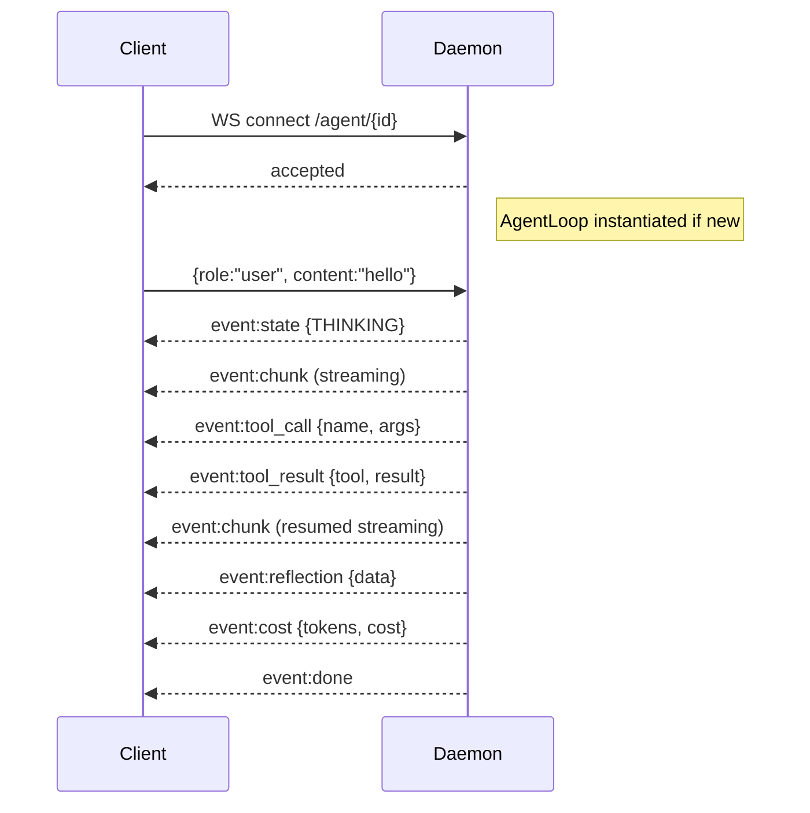
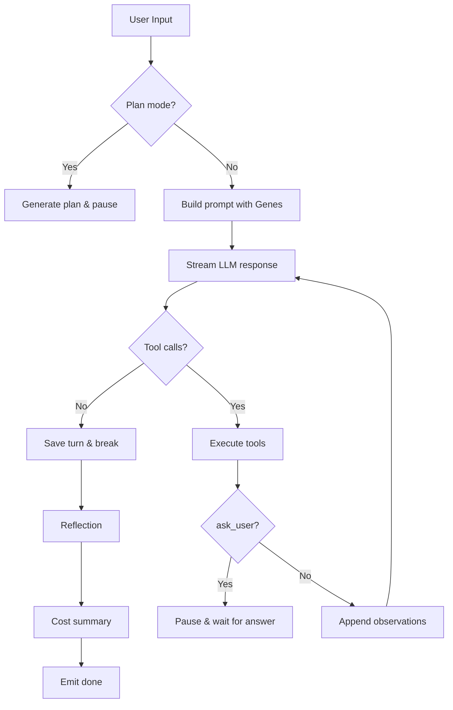

# Architecture

## Overview

- A single long-lived **Daemon** owns the Gateway (FastAPI + WebSocket) and the Agent runtime.
- **Clients** (desktop app, CLI, web UI) connect to the Daemon over **WebSocket** on the configured bind host (default `127.0.0.1:8765`).
- **AgentLoop** runs inside the Daemon. It is the only place that holds LLM state, tool registry, and memory managers.
- One Daemon per host; it is the only place that opens LLM streaming sessions and vector DB connections.
- The **Web UI** is served by the Daemon HTTP server under `/` (static files) and `/agent/{id}` (WebSocket endpoints).

## Components and flows

### Daemon (gateway + runtime)
- Maintains WebSocket connections for all clients.
- Exposes a typed WS API (streaming chunks, state events, tool results, ask_user pauses).
- Validates inbound frames and routes them to the correct AgentLoop instance.
- Emits events: `chunk`, `state`, `tool_call`, `tool_result`, `ask_user`, `reflection`, `cost`, `done`, `error`.
- Hosts the evolution scheduler, which periodically analyzes conversation logs and generates Genes/Skills.

### Clients (desktop / CLI / web)
- One WS connection per client session.
- Send user messages as JSON frames.
- Subscribe to streaming events and render them in real time.
- The desktop app uses PySide6; the CLI uses `prompt_toolkit` + `rich`; the web UI uses vanilla JS.

### AgentLoop (core runtime)
- Receives user input and assembles the full message context.
- Injects matched **Genes** into the system prompt via `PromptBuilder`.
- Streams the LLM response and parses tool calls (`<function>...</function>`).
- Dispatches tool execution through `ToolRegistry`.
- Saves conversation turns to `MemoryManager`.
- Runs `ReflectionEngine` after the loop ends.

### Memory
- **SessionManager**: JSONL logs per agent.
- **SQLiteStore**: Structured metadata (configs, todos, tasks, insights).
- **VectorStore**: SQLite-vec + LLM embeddings for semantic search.

### Evolution
- **EvolutionEngine**: Observes logs, detects patterns, and triggers Gene/Skill generation.
- **GeneForge / SkillForge**: LLM-based code generation.
- **EvolutionValidator**: Compiles, imports, instantiates, and executes generated code before registration.
- **GeneManager**: Matches user input to Genes and injects them into prompts.
- **ToolRegistry**: Hot-reloads generated Skills without restart.

## Connection lifecycle (single client)



## Wire protocol (summary)

- Transport: WebSocket, text frames with JSON payloads.
- After connection accept, clients send messages as:
  `{role: "user", content: "..."}`
- The Daemon responds with a stream of events. Each event is a JSON object with a `type` field.

### Event types

| Type | Direction | Description |
|------|-----------|-------------|
| `chunk` | S→C | Streaming text fragment from the LLM |
| `state` | S→C | Agent state change (`THINKING`, `TOOL_CALL`, `WAITING`, etc.) |
| `tool_call` | S→C | Notification that a tool is about to be executed |
| `tool_result` | S→C | Result of a tool execution |
| `ask_user` | S→C | Pause the loop and wait for human input |
| `reflection` | S→C | Post-conversation self-review result |
| `cost` | S→C | Token usage and estimated cost summary |
| `done` | S→C | End of the current turn |
| `error` | S→C | Runtime error |

### Example frames

Client send:
```json
{"role": "user", "content": "Write a Python script that prints hello"}
```

Server events (stream):
```json
{"type": "state", "state": "THINKING", "thought": "Analyzing request..."}
{"type": "chunk", "content": "I'll"}
{"type": "chunk", "content": " create"}
{"type": "tool_call", "tool": "file_write", "args": {"path": "hello.py", "content": "print('hello')"}}
{"type": "tool_result", "tool": "file_write", "result": "File written: hello.py"}
{"type": "reflection", "data": {"summary": "Task completed", "problems": [], "lessons": [], "improvements": []}}
{"type": "cost", "tokens": 420, "cost": 0.002}
{"type": "done"}
```

## AgentLoop lifecycle



## Data flows

### Request flow
1. Client sends a message over WS.
2. Daemon routes it to `AgentOrchestrator.run_agent()`.
3. `AgentLoop.run()` loads context from `MemoryManager`.
4. `PromptBuilder` assembles the system prompt, injecting matched Genes.
5. `LLMRouter.stream()` sends the request to the configured provider.
6. Chunks are yielded back to the client in real time.
7. Tool calls are parsed and dispatched to `ToolRegistry.execute()`.
8. Observations are appended to the message history for the next turn.
9. After the loop ends, `ReflectionEngine.reflect()` analyzes the conversation.
10. `MemoryManager` saves the turn and any new insights.

### Evolution flow
1. `EvolutionEngine` reads recent JSONL session logs.
2. `PatternDetector` extracts intent frequencies and user feedback signals.
3. `TrendAnalyzer` identifies high-frequency needs and pain points.
4. `InsightExtractor` generates structured insights.
5. If VFM score is high enough, `GeneForge` and/or `SkillForge` generate code.
6. `EvolutionValidator` compiles, imports, instantiates, and runs the generated code.
7. Valid Genes are registered in `GeneManager`; valid Skills are saved to `shared/skills/`.
8. `ToolRegistry` hot-reloads new Skills on the next tool lookup.
9. Results are written to `shared/memory.db` and `MEMORY.md`.

## Invariants

- **One Daemon per host**: There is never more than one XMclaw Daemon process running on a single machine.
- **One AgentLoop per agent_id**: `AgentOrchestrator` maintains a single `AgentLoop` instance per agent ID.
- **WebSocket is the only transport**: All real-time communication between clients and the Daemon uses WebSocket.
- **Genes are read-only at runtime**: Genes are matched and injected into prompts; they do not mutate during a turn.
- **Skills are hot-reloaded**: Newly generated Skills become available without Daemon restart, but existing turns do not retroactively gain access to them.
- **Memory is persisted immediately**: Every conversation turn is written to JSONL and vector store before the `done` event is emitted.
- **Reflection is best-effort**: If the reflection LLM call fails, the turn still completes normally.

## Related

- [Tools](./TOOLS.md) — Tool registry, built-in tools, and skill generation
- [Evolution](./EVOLUTION.md) — Gene/Skill generation, VFM scoring, and hot reload
- [Desktop](./DESKTOP.md) — Native PySide6 app usage
- [CLI](./CLI.md) — Terminal client and commands