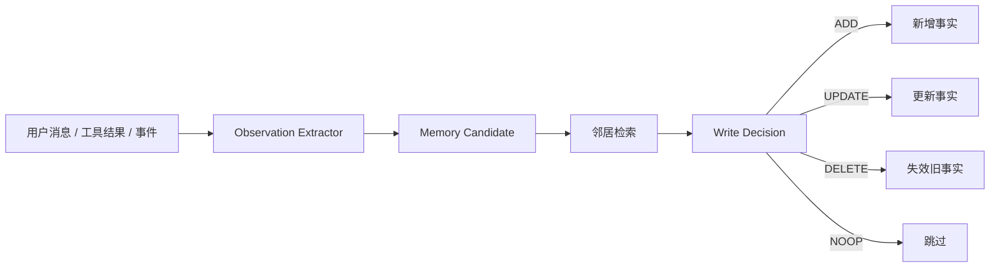
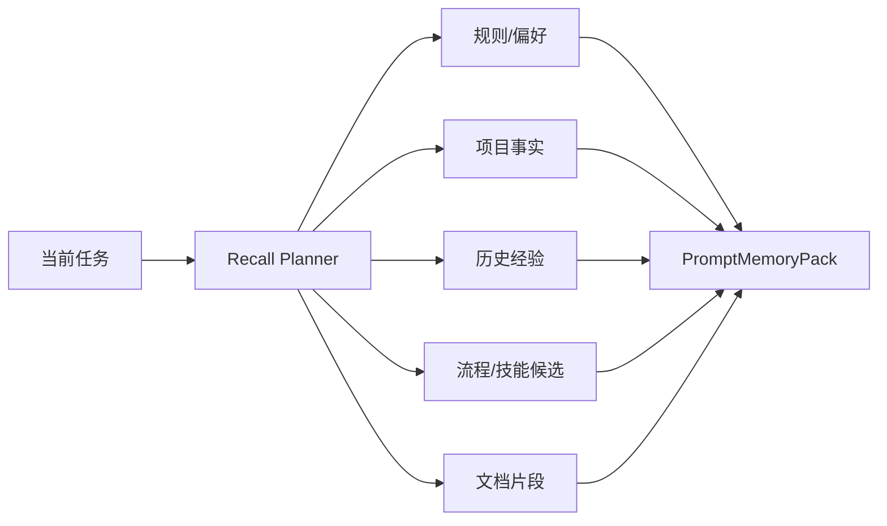

# XMclaw 记忆与事件系统重构方案（修订版）

日期：2026-06-25

> 本文件替代 2026-06-24 旧稿。旧稿中关于 `EnvironmentMemory`、`EnvironmentMemoryWatcher`、`EnvironmentStore`、环境审计页面、MD 自动投影为事实视图等方向已经废弃。

## 结论

这次重构的核心不是“给本机环境单独做一套记忆”，也不是把所有内容都投影到 MD 文件里。真正的问题是：Agent 执行闭环、记忆写入、记忆召回、技能调用、事件沉淀之间缺少统一治理，导致它会乱记、乱召回、不会主动查、失败后死磕同一种方法。

新的方向是：

- `Memory Gateway` 是记忆治理入口，负责召回计划、候选写入、写入决策、固化和运行时打包。
- 结构化事实库是长期事实的权威来源。
- 向量库是检索索引，不是事实源。
- 工作区 MD 文件是人类可读、可编辑的手动提示词和项目手册，不再自动承载结构化事实投影。
- `events.db` 是原始经历日志，不能直接当长期记忆。
- `Artifact Ledger` 记录当前任务产物、下载物、安装物、版本检查目标和路径，解决“刚下载完却找不到”的执行状态问题。
- 技能系统必须提供可浏览、可查询、可选择、可跳过的结构化入口，而不是只给模型一段提示词。

## 分工边界

| 层 | 作用 | 不做什么 |
| --- | --- | --- |
| 工作区 MD 文件 | 用户/项目手动规则、长期说明、可读手册 | 不自动塞满事实，不作为事实库镜像 |
| 结构化事实库 | 已验证长期事实、偏好、规则、项目规律 | 不保存未完成任务的猜测 |
| 向量库 | 对事实、片段、文档 chunk 建索引，支持召回 | 不决定事实真假 |
| events.db | 原始事件日志和审计轨迹 | 不直接注入 prompt |
| Memory Candidate | 自动抽取的待审候选 | 不默认固化 |
| Artifact Ledger | 当前任务产物和路径状态 | 不变成长期偏好 |
| PromptMemoryPack | 每轮运行时上下文包 | 不拼接散乱来源 |
| Skill Browser | 查询技能能力、约束行为、选择调用 | 不只显示技能数量 |

## 写入逻辑

长期记忆写入必须先变成候选，再经过决策。

强约束：

- 未完成任务中的中间猜测不得写入长期记忆。
- 工具失败结果不得写成成功经验。
- Assistant 自己推测的方法不得直接固化。
- 用户明确纠正、明确偏好、明确规则，可以生成高优先级候选。
- 任务完成后，才能从成功轨迹中抽取可复用流程。
- 多次稳定成功的流程，才进入技能候选。

每条候选至少要带：

- `source_event_id`
- `source_type`
- `candidate_type`
- `confidence`
- `evidence`
- `decision`
- `decision_reason`
- `neighbors`
- `task_status`

## 召回逻辑

召回不能再是“用户消息 -> vector top_k -> 塞 prompt”。必须先生成 `RecallPlan`。

每条召回结果必须解释：

- 为什么召回；
- 来源是什么；
- 可信度是多少；
- 是否仍然有效；
- 它应该如何影响下一步行动。

这样模型拿到的不是一堆相似文本，而是行动依据。

## MD 文件与结构化事实库

最终定位如下：

1. 用户手动写进 MD 的规则、项目手册、偏好说明，可以被 `md_sync` 摄取成 `persona_manual` 类型事实。
2. 自动抽取的事实默认不反向写入 MD。
3. 渲染 persona 文件时默认只包含手动内容，不混入自动事实块。
4. 前端记忆页面负责展示结构化事实、候选、来源和决策，不靠 MD 文件展示事实状态。
5. 如果 MD 与结构化事实冲突，按“用户本轮明确指令 > 手动规则 > 已验证结构化事实 > 自动候选 > 文档 chunk > 旧事件”的顺序处理。

这能避免“MD 文件、向量事实库、事件日志三边各写一份，最后不知道谁是真的”。

## 事件系统

事件系统只负责记录原始轨迹和触发分析，不直接写长期记忆。

需要优先结构化的事件：

- 工具开始、完成、失败；
- 下载、生成、移动、安装、删除等 artifact 变化；
- 用户纠正路径、版本、偏好、规则；
- 连续失败；
- 模型主动跳过技能或记忆查询；
- 技能查询、技能命中、技能调用、技能跳过；
- 记忆候选创建、确认、拒绝、固化。

连续失败后，Agent 必须切换策略：

- 查询相关记忆；
- 查询相关技能；
- 检查 artifact ledger；
- 调整计划；
- 必要时向用户确认。

## 技能系统

技能不是装饰，也不是“装了多少个”的数字。它的职责是约束和增强 Agent 行为。

需要具备：

- `skill_status`：显示注册技能、扫描路径、加载失败、未注册候选。
- `skill_browse`：按任务查询可能相关技能。
- `skill_view`：查看技能内容和适用场景。
- `skill_decision`：结构化记录使用、跳过或继续查询的理由。
- 技能安装兼容层：支持识别可转换的外部格式，不能静默失败。
- 技能自修正：允许把兼容技能规范化成 XMclaw 可用格式，但必须保留来源和变更记录。

Agent 在复杂任务开始前、连续失败后、命中候选技能时，必须主动查询技能。

## 已完成的 P0 修正

- 移除了环境审计方向，不再保留 `EnvironmentMemoryWatcher` 和环境审计页面。
- 写入策略增加硬门槛，阻止未验证、失败、中间态、猜测内容直接进入长期记忆。
- 增加记忆候选池和前端候选审核视图。
- 引入 `Artifact Ledger`，记录任务产物路径和版本检查目标。
- `PromptMemoryPack` 统一运行时注入，并加入主动查询记忆和技能的约束。
- MD 同步改为手动内容优先，不再默认把自动事实渲染进 persona 文件。
- 技能系统增加扫描根、未注册候选、加载失败、结构化跳过理由和 `skill_decision`。

## 剩余 P0

- 增加 `memory_decision` 工具，结构化记录“使用/跳过/继续查询记忆”的理由。
- 召回结果补齐 `why_recalled`、`recommended_action`、`validity`、`confidence`。
- 将 `RecallPlan`、技能决策、记忆决策、artifact 状态深度写入 GraphState/reducer。
- 前端展示每轮“查了哪些记忆、用了哪些技能、为什么跳过”的时间线。
- 对自动候选做质量评分，低质量候选默认不进入审核队列。
- 把连续失败策略切换接入 Agent 主循环，而不是只在提示词里提醒。

## 不再做的方向

- 不做独立的环境记忆产品分支。
- 不做环境审计页面。
- 不把“路径事件”一律沉淀成长期环境记忆。
- 不把结构化事实默认投影回 MD 文件。
- 不把向量库当事实源。
- 不把失败轨迹和中间猜测写成经验。

